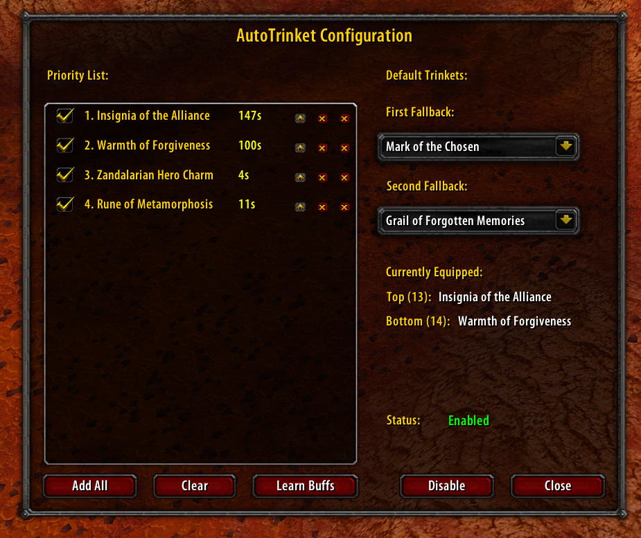
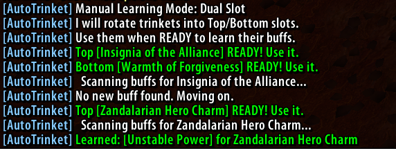

# AutoTrinket

**AutoTrinket** is a powerful, priority-based trinket manager for World of Warcraft Classic. It automatically equips your best available trinkets based on a single unified priority list, ensuring you always have your most powerful cooldowns ready to use.

## Key Features

- **Unified Priority System**: Maintain a single list of trinkets. The addon automatically manages both trinket slots (13 & 14).
- **Auto-Equip Logic**: The top 2 trinkets that are **off cooldown** are ALWAYS equipped.
- **Smart Swapping**: As soon as a high-priority trinket comes off cooldown, it gets swapped in.
- **Buff Protection**: Prevents swapping out a trinket while its active buff (e.g., *Earthstrike*, *Kiss of the Spider*) is still running on you.
- **Fallback Mode**: Sets specific "Default" (passive) trinkets to equip when all your active trinkets are on cooldown.
- **Safety Checks**: Swaps only occur when you are out of combat, alive, and not casting or mounted.

---

## Quick Start Guide

### 1. Configuration
Open the visual configuration window:
```
/autotrinket config
```



### 2. Build Your Priority List
- **Add All**: Click the **"Add All"** button in the config window. This automatically scans your bags and equipment and adds every trinket found to your priority list.
- **Order Matters**: Use the Arrow buttons next to each trinket to define your preferred order.
  - *Top of list = Highest Priority (Equipped as soon as ready)*
  - *Bottom of list = Lowest Priority*

### 3. Set Default Fallbacks (Optional)
When all your high-priority active trinkets are on cooldown, the addon will equip your fallback trinkets (usually passive stats).
1. Equip your preferred passive trinket (e.g., *Drake Fang Talisman*).
2. Select it in the **"First Fallback"** dropdown menu in the config.
3. Repeat for **"Second Fallback"**.

### 4. Learn Trinket Buffs (Critical!)
To ensure the addon doesn't unequip a trinket while you are still enjoying its buff effect:
1. Click the **Learn Buffs** button in the config.
2. The addon will enter "Learning Mode" and start rotating your trinkets into your slots.
3. Watch the chat window. When it says **"Top [Trinket Name] READY! Use it."** (or Bottom):
   - **Manually use the trinket**.
4. The addon will detect the new buff, save it, and automatically cycle to the next trinket.
5. Repeat until all trinkets are processed.

*Note: You only need to do this once per trinket. The addon saves this data permanently.*



### 5. Enable
Click **Enable** in the config window or type:
```
/autotrinket
```

---

## Commands

All configuration is done via the visual UI, and very simple chat commands:

| Command | Action |
| :--- | :--- |
| `/autotrinket config` | Opens the Configuration GUI. |
| `/autotrinket` | Toggles the addon On (Enabled) or Off (Disabled). |
| `/autotrinket help` | Shows the available commands. |

*Note: `/at` is also an alias for `/autotrinket`.*

---

## Tips

- **Dual Slot Learning**: The "Learn Buffs" mode uses both trinket slots to speed up the process. Pay attention to whether it asks you to use the **Top** or **Bottom** trinket.
- **Overwriting**: If a trinket was learned incorrectly, simply run "Learn Buffs" again to overwrite the old data.
- **Combat Safety**: The addon will pause all swapping operations while you are in combat to prevent errors. Queued swaps will execute immediately after combat ends.

---
*Created for efficient raiding and seamless cooldown rotations.*

